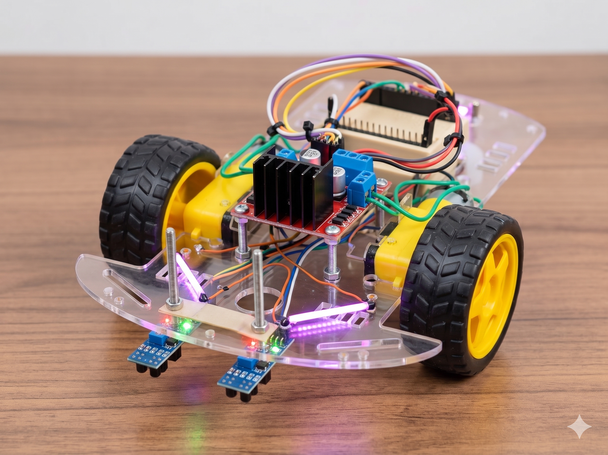
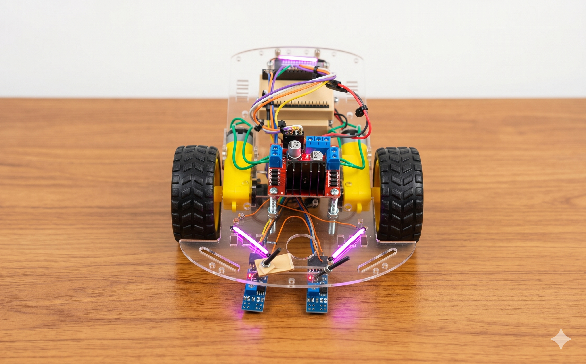

# Carrinho Seguidor de Linha — Versão ESP32 + Controle de XBOX

Robô seguidor de linha usando sensores infravermelhos, com função adicional de controlar por um controle de Xbox Series X via Bluetooth (estilo *Forza*: gatilhos aceleram/freiam e o analógico esquerdo esterça).

Projeto feito para atividade *Hands-On de Robótica* da disciplina de
**Robótica Aplicada** (Engenharia de Computação — Prof. Milton Miranda Neto).

  
  

---

## Mudanças em relação ao modelo original

| Item | Kit padrão da aula | **Esta versão** |
|------|--------------------|-----------------|
| Cérebro | Arduino Uno (5 V) | **ESP32** (3,3 V, Wi-Fi + Bluetooth) |
| Alimentação | 4× pilhas AA (6 V) | **2× células 3,7 V Li-ion** (reaproveitadas de um *vape* descartado) em série ≈ 7,4 V |
| Carregamento | Trocar pilhas | **2× módulos TP4056** ligados em série (recarga via USB) |
| Controle manual | — | **Joystick Xbox Series X** por Bluetooth (modo *Forza*) |
| Driver dos motores | L298N usando ENA/ENB | **L298N sem ENA/ENB** — o PWM vai direto nos pinos IN |
| Extras | — | **Farol de LED** liga/desliga pelo controle |
| Estrutura | Chassi do kit | Chassi + **cases impressas em 3D** (ESP32 e bateria) |

---

## Funcionamento

O firmware tem **dois modos**, alternados pelo botão **Y** do controle:

### 1. Modo Autônomo 
Lê os dois sensores TCRT5000 e decide o movimento:

> **HIGH = sensor sobre a linha preta** · **LOW = sensor sobre o chão claro**

| Sensor Esq. | Sensor Dir. | Situação | Ação |
|:-----------:|:-----------:|----------|------|
| HIGH | HIGH | Ambos na linha → **marca de parada** | Para, dá uma ré curtinha e fica parado 3 s |
| LOW  | HIGH | Linha só à direita | Gira para a **direita** |
| HIGH | LOW  | Linha só à esquerda | Gira para a **esquerda** |
| LOW  | LOW  | Nenhum na linha | Segue **em frente** |

### 2. Modo Manual 
Pressione **Y** para usar o controle:

- **Gatilho RT** → acelera para frente
- **Gatilho LT** → ré / freio
- **Analógico esquerdo (eixo X)** → esterçamento (vira para os lados)
- **Botão X** → liga/desliga o **farol** de LED (funciona nos dois modos)
- **Botão Y** → alterna entre Manual e Autônomo

A mistura de aceleração + direção é feita por *differential drive*:

## Hardware

| Componente | Qtd. | Função |
|------------|:----:|--------|
| ESP32 DevKit | 1 | Microcontrolador (cérebro) |
| Ponte H L298N | 1 | Driver de potência dos motores |
| Motor DC com redutor + roda | 2 | Tração traseira |
| Rodízio (roda boba) | 1 | Apoio dianteiro |
| Sensor TCRT5000 (IR) | 2 | Detecção da linha |
| Célula Li-ion 3,7 V | 2 | Alimentação (em série ≈ 7,4 V) |
| Módulo carregador TP4056 | 2 | Recarga das células (em série) |
| LEDs (farol) | 1+ | Iluminação frontal |
| Chassi + cases 3D | — | Estrutura |

### Pinagem (ESP32)

| Sinal | GPIO | Observação |
|-------|:----:|-----------|
| L298N **IN1** (Motor Esq.) | 27 | PWM de direção/velocidade |
| L298N **IN2** (Motor Esq.) | 26 | PWM de direção/velocidade |
| L298N **IN3** (Motor Dir.) | 25 | PWM de direção/velocidade |
| L298N **IN4** (Motor Dir.) | 33 | PWM de direção/velocidade |
| Sensor IR **Esquerdo** (OUT) | 34 | *Input-only* no ESP32 |
| Sensor IR **Direito** (OUT) | 35 | *Input-only* no ESP32 |
| **Farol** (LEDs) | 4 | Saída digital |

O passo a passo completo de montagem e ligação está em
**[`Montagem/`](Montagem/)**.
